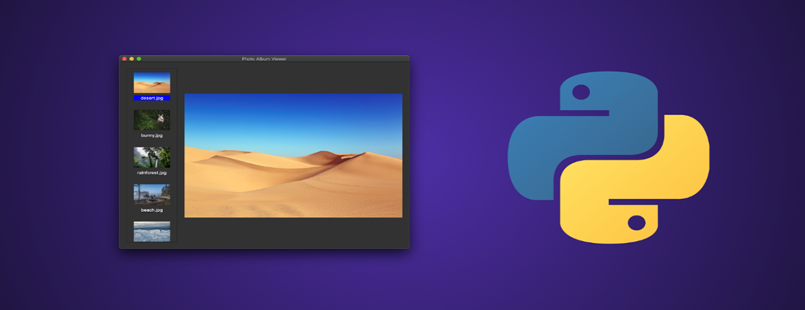

# Drip Life Science GUI 


[](#contributors-)



## 📌 Prerequisites
- Windows 10
- [Python](https://www.python.org/downloads/release/python-387/) (Python 3.8.7)
- [Git](https://git-scm.com/) (Git 2.30.0)

## 💻 Clone
Open Git Bash and type the following code
```sh
$ git clone https://github.com/DRIP-AI-RESEARCH-JUNIOR/Life_Science.git
```

## :rocket: Get started 
1 - Install python latest version from the link provided in the prerequisite in your system.

2 - Double click the ExeGenerator.bat file.

3 - The generated exe file shall be located in EXE_File folder.
